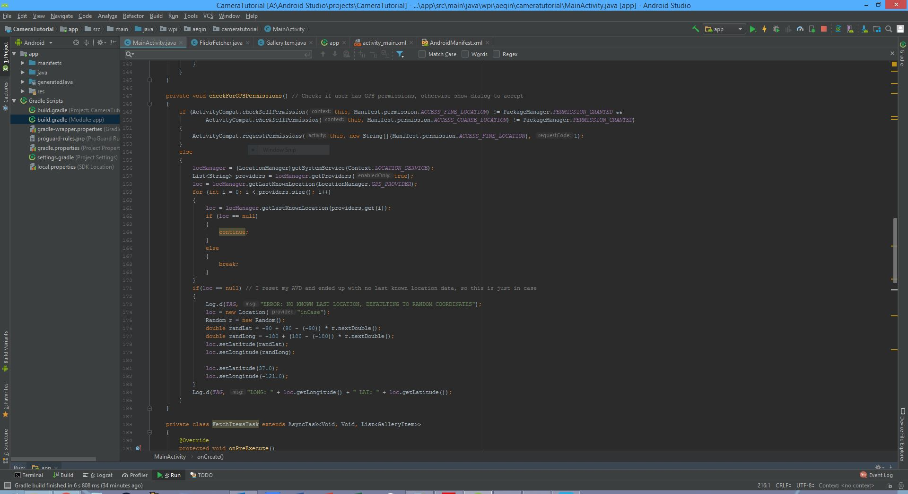

# Antony Qin's Project2 Part2 Tutorial
## Overview of Tutorial
Duration: ???

This tutorial will show you how to separate improve upon part1 of project2 by getting location data of where the camera was used, and querying Flickr in order to display images that were taken close by to where the camera was used.

* Location Data!
* Flickr Queries!

Prerequisites:

* Part1 of CS4518 Project2
* Knowledge of XML layout design

## Miscellaneous: 
Duration: 5 - 10 minutes
* Go to AndroidManifest.xml and add the following:
```
    <uses-permission android:name="android.permission.INTERNET"/>
    <uses-permission android:name= "android.permission.WRITE_EXTERNAL_STORAGE" /> <!-- This line should have been added in part1 -->
    <uses-permission android:name="android.permission.ACCESS_FINE_LOCATION" />
```
* This is because the program will need location data as well as the internet

* Go to the build.gradle (Module: app) file and add the following:
```
    implementation 'com.squareup.picasso:picasso:2.71828'
```
* This is because we will be using Picasso to quickly & easily display images given an URL

## On to Writing Code:
Duration: ??? minutes

### Getting user permissions
* Go to MainActivity.Java
* In order to get location data from the user, first we must check for permission, and if not found ask for it
* Create a new function called checkForGPSPermissions() that will do so



* Inside the OnClickButton() from part1, add a call to this method after verifying a photo has been taken


### Querying Flickr
* If any of the following looks familiar, it's because it follows Chapter 25 of the textbook
* Make sure to grab an API key from Flickr at the following link under 'apply for a non-commercial key': https://www.flickr.com/services/apps/create/apply
* Then create the class FlickrFetcher.java just like in the chapter


* There are a few differences:
    * Our FlickrFetcher has a constructor that takes in a latitude and longitude in order to make use of our location data
    * Most importantly, inside fetchItems() instead of using the Flickr method 'flickr.photos.getrecent', we are using the method 'flickr.photos.search'


* With the method 'flickr.photos.search', we'll have to modify some parameters in order to include our location data (latitude and longitude)
    * We also include a radius parameter (in kilometers) to make the location data return more results than an exact coordinate
* You'll notice that GalleryItem.java from the chapter is also used in FlickrFetcher.


* Most importantly, it includes a new getURL() method that will be used later with Picasso to display URL images from Flickr
* Now back to MainActivity.java, let's write the an AsyncTask that utilizes FlickrFetcher in a background thread to obtain the related location images


* The most important bits of FetchItemsTask are:
    * Another checkForGPSPermissions() in the OnPreExecute() method
    * Instantiating a FlickrFetcher() to fetch our related location images in the doInBackground() method
    * Setting a global list of GalleryItem (mItems in my case) in the OnPostExecute() method
    * And finally utilizing Picasso in a for loop to iterate through the list of GalleryItems and setting ImageViews in the application
    
### Congratulations, You've Completed the Main Tutorial!

* If you want to be extra, you can add a onClick() method to any imageView thumbnails you set in your application, that expand their image into the picture your camera took while shrinking camera image down into the thumbnail that was initially clicked. Trust me, the swapping headaches are absolutely terrible.
* This is what my main layout looked like:


* imageView_camera is the big android face, the main image
* textView_latLong display latitude and logitude of user
* button_camera sends the camera intent
* textView_picURL displays either the name of the taken picture, or the caption of a Flickr image, depending on which is in the main image
* linearLayout_thumbs is filled with imageViews in code, and holds thumbnails of related images (by location) that are shown under the main image

* This is the main function I added to my imageView thumbnails in order to have them swap with the main image


